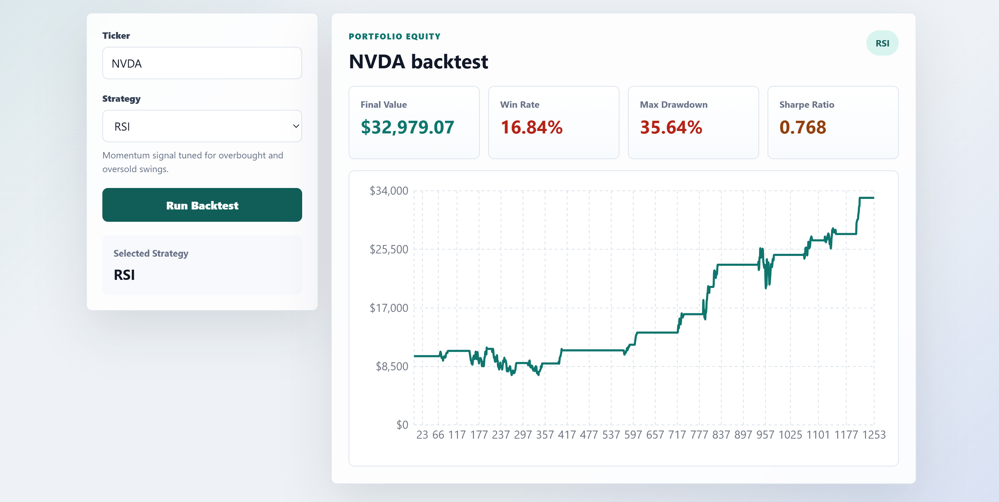
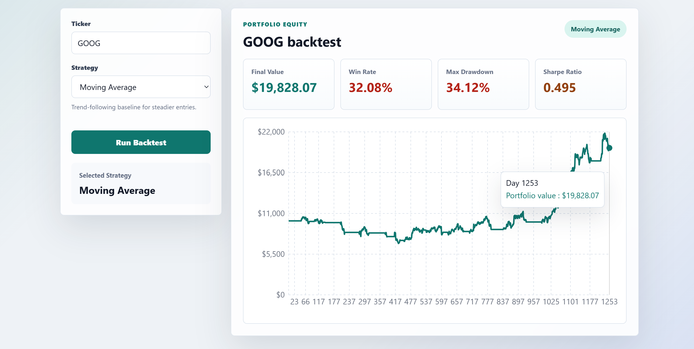

# Stock Backtesting Engine

A full-stack algorithmic trading backtester built to test trading strategies against real historical market data. Supports Moving Average Crossover, RSI, and an LSTM-based machine learning strategy. Built as a portfolio project targeting finance technology roles.

---

## Demo


> RSI on NVDA (5 years)


> Moving Average on GOOGL (5 years)
---

## Tech Stack

**Backend**
- Python, FastAPI, uvicorn
- pandas, numpy, yfinance
- TensorFlow / Keras (LSTM model)
- scikit-learn (MinMaxScaler)

**Frontend**
- React, Recharts
- CSS (custom, no framework)

---

## Project Structure

```
Stock-Backtesting-Engine/
├── backend/
│   ├── data/           # yfinance data fetching with local CSV cache
│   ├── strategies/     # Moving Average, RSI signal generators
│   ├── backtest/       # Core simulation engine
│   ├── metrics/        # Sharpe ratio, max drawdown, win rate
│   ├── ml/             # LSTM model, feature engineering, prediction
│   └── main.py         # FastAPI app
└── frontend/
    └── src/
        └── App.js      # React dashboard
```

---

## How the Strategies Work

**Moving Average Crossover**
Computes a 20-day and 50-day simple moving average on the closing price. When the short-term average crosses above the long-term average, momentum is building — buy signal. When it crosses below — sell signal. A classic trend-following approach.

**RSI (Relative Strength Index)**
Measures the speed and magnitude of recent price changes on a 0–100 scale. RSI below 30 means the stock is oversold and likely to bounce — buy signal. RSI above 70 means it is overbought and likely to pull back — sell signal. A momentum-based contrarian approach.

**LSTM (Long Short-Term Memory)**
A recurrent neural network trained on 60-day sequences of Close price, Volume, RSI, SMA20, and SMA50. The model predicts the probability that tomorrow's price will be higher than today's. A buy signal fires when probability exceeds 0.6, a sell signal when it falls below 0.4. Trained on 5 years of daily data with an 80/20 train/test split.

---

## What the Metrics Mean

| Metric | What it measures |
|---|---|
| **Final Value** | Portfolio value at end of backtest period, starting from $10,000 |
| **Sharpe Ratio** | Risk-adjusted return. Above 1 is good, above 2 is excellent, below 0 means you underperformed a risk-free savings account |
| **Max Drawdown** | The worst peak-to-trough decline experienced. A drawdown of 29% means at some point your portfolio had fallen 29% from its highest value |
| **Win Rate** | Percentage of trading days with a positive return |

---

## Key Findings

Backtested over 5 years (2021–2026):

| Ticker | Strategy | Final Value | Sharpe Ratio | Max Drawdown | Win Rate |
|---|---|---|---|---|---|
| GOOG | Moving Average | $19,828 | 0.495 | 34.12% | 32.08% |
| NVDA | RSI | $32,979 | 0.768 | 35.64% | 16.84% |
| AAPL | Moving Average | $12,632 | 0.072 | 29.09% | 28.65% |
| AAPL | RSI | $15,643 | 0.296 | 29.68% | 22.75% |
| AAPL | LSTM* | $10,000 | 0.000 | 0.00% | — |

*LSTM available locally only — see setup instructions.

**Observations:**
- RSI on NVDA produced a 230% return over 5 years, capturing NVDA's strong momentum-driven moves while avoiding extended drawdown periods through oversold/overbought signals
- Moving Average on GOOG produced a 98% return, benefiting from GOOG's clear trend structure which suits trend-following strategies
- RSI outperformed Moving Average on AAPL, consistent with AAPL's tendency for mean reversion after sharp moves
- Both strategies underperformed simple buy and hold, which is expected in a strong bull trend — moving average and RSI strategies are better suited to volatile, sideways markets
- The LSTM achieved 52% directional accuracy on out-of-sample data. While low, this aligns with the Efficient Market Hypothesis — if price direction were easily predictable at high accuracy, arbitrage would eliminate the opportunity. The model's conservative threshold (0.6/0.4) means it correctly avoids overconfident signals

---

## Setup

**Prerequisites:** Python 3.10+, Node.js 18+

**1. Clone the repository**
```bash
git clone https://github.com/darshbir19/Stock-Backtesting-Engine.git
cd Stock-Backtesting-Engine
```

**2. Install Python dependencies**
```bash
pip install fastapi uvicorn yfinance pandas numpy scikit-learn tensorflow
```

**3. Train the LSTM model**
```bash
py -3.13 -m backend.ml.model
```
This downloads 5 years of AAPL data, trains the LSTM for 10 epochs, and saves the model and scaler to `backend/ml/`.

**4. Start the FastAPI backend**
```bash
py -3.13 -m uvicorn backend.main:app --reload
```
API runs at `http://localhost:8000`. Interactive docs at `http://localhost:8000/docs`.

**5. Start the React frontend**
```bash
cd frontend
npm install
npm start
```
Dashboard runs at `http://localhost:3000`.

**6. Run a backtest**

Open the dashboard, enter a ticker (e.g. AAPL, MSFT, NVDA), select a strategy, and click Run Backtest.

Or call the API directly:
```
GET http://localhost:8000/backtest?ticker=AAPL&strategy=moving_average
GET http://localhost:8000/backtest?ticker=AAPL&strategy=rsi
GET http://localhost:8000/backtest?ticker=AAPL&strategy=lstm
```

---

## Future Improvements

- **Position sizing** — currently all-in or all-out. A real system would size positions based on volatility (e.g. Kelly Criterion)
- **Short selling** — current engine only goes long. Adding short positions would allow profiting from downtrends
- **Multi-asset portfolio** — backtest a basket of stocks with correlation-aware allocation
- **Walk-forward validation** — retrain the LSTM on a rolling window to avoid lookahead bias
- **More LSTM features** — adding MACD, Bollinger Bands, and sector momentum signals would likely improve directional accuracy
- **Transaction costs** — current backtest ignores slippage and commissions, which would reduce real-world returns

---

## Author

**Darshbir Singh**  
Computer Engineering, HKUST  
[GitHub](https://github.com/darshbir19) · [LinkedIn](https://www.linkedin.com/in/darshbirsingh/)